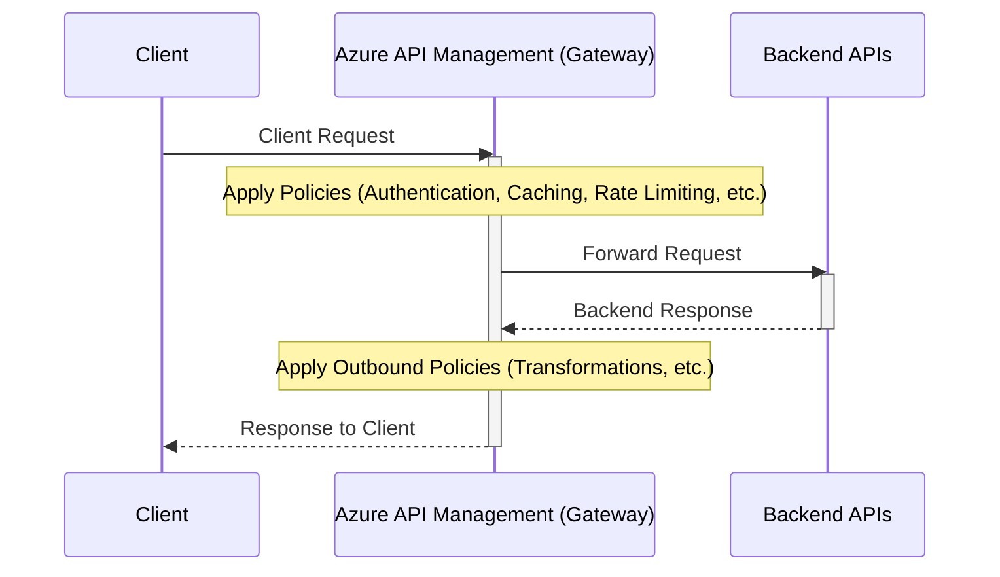

# Azure API Management

Azure API Management (APIM) is a fully managed service that acts as a **gateway** or **reverse proxy** for your backend APIs. It allows you to publish, secure, transform, maintain, and monitor your APIs, providing a single point of entry for developers and consumers.

## Standard Architecture

In a typical setup, Azure API Management sits between your API consumers (clients like mobile apps, web browsers) and your backend APIs:

*   **Clients** do **not** call your backend APIs directly.
*   Clients interact with the **Azure API Management endpoint (Gateway)**.
*   The APIM Gateway then forwards the requests to your **backend APIs**.

This architecture allows APIM to apply policies and features to the requests and responses as they pass through the gateway.

## Defining Backend APIs in APIM

You need to define your backend APIs within your APIM instance. This can be done in several ways:

  

1.  **Manually:** Specify the HTTP endpoint of your backend API.
2.  **From OpenAPI Specification:** Import an API definition using an OpenAPI (Swagger) specification file (often the **recommended** approach for complex APIs).
3.  **From Azure Resources:** Directly onboard backend APIs hosted on other Azure services, such as:
    *   Azure App Service
    *   Azure Functions
    *   Azure Logic Apps

## Features and Benefits

By routing requests through the APIM gateway, you can add valuable capabilities to your APIs without modifying your backend code:

*   **Security:** Protect your backend APIs. By default, APIM secures your APIs by requiring clients to provide a **Subscription Key** with their requests. Access is denied without a valid key. (More advanced security like token validation can also be added via policies).
*   **Caching:** Cache API responses to improve performance and reduce load on backends.
*   **Throttling:** Implement rate limits to control the number of requests clients can make within a certain period.
*   **Transformation:** Modify request and response payloads (e.g., change formats).
*   **Monitoring:** Gain visibility into API usage and performance.

## Accessing APIs via the Gateway

Once an API is defined in APIM, clients call the specific endpoint provided by the APIM service instance, not the original backend URL. This endpoint typically includes the APIM instance name and the defined API path (e.g., `https://<your-apim-name>.azure-api.net/<api-path>/...`).

## Testing APIs

The Azure portal provides a built-in **Test** tab within the APIM blade. This allows you to easily test your configured API operations directly from the portal. It often autopopulates necessary security parameters like the default subscription key for convenience during testing.

  

