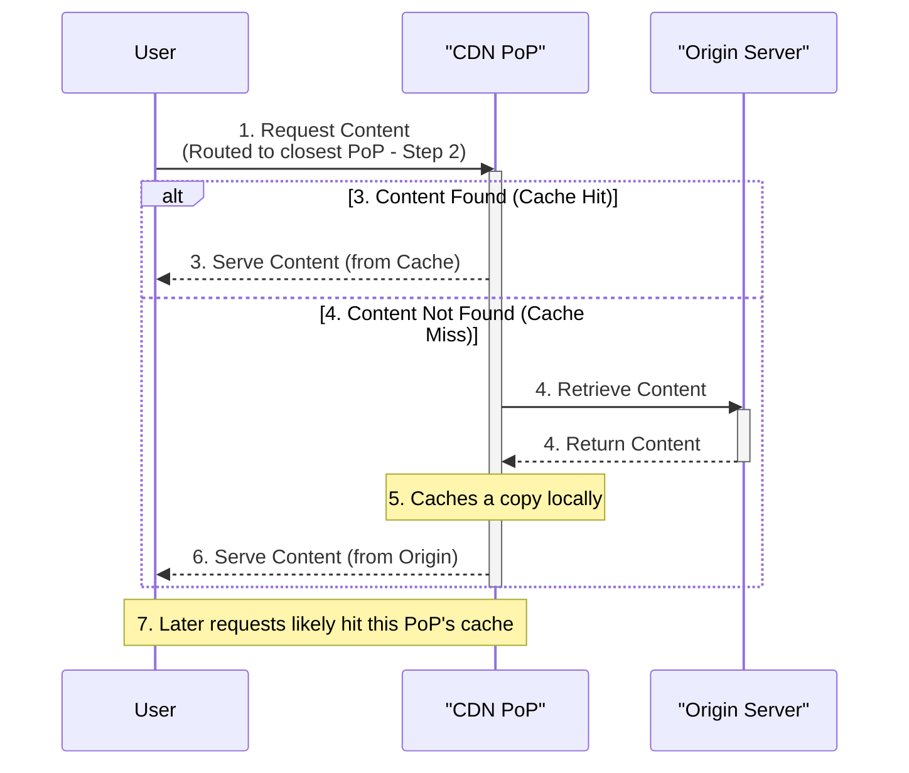

# CDN

A **Content Delivery Network (CDN)** is fundamentally a set of **reverse proxies distributed around the world**. Its primary purpose is to **cache content** closer to users, reducing latency and improving application performance.

## How CDN Works

Imagine a central origin server (e.g., hosting a website) located in one region, with users spread globally. Without a CDN, every user request travels all the way to that central server to retrieve content.

With a CDN:

1.  The CDN provider has a network of **Points of Presence (PoPs)**, which are those reverse proxy servers, strategically located in various geographic regions around the world.
2.  When a user requests content (like an image or file), the request is routed to the **closest CDN PoP**.
3.  If the content is already cached on that PoP, the CDN serves the content directly to the user from the nearby location (a **cache hit**). This is rapid.
4.  If the content is not cached on that PoP (a **cache miss**), the CDN PoP retrieves the content from the origin server, caches a copy locally, and then delivers it to the user.

Later requests from users near that same PoP for the same content will likely result in a cache hit.

## Content Cached on CDNs

CDNs are typically used to cache **static content**. This includes:

*   Images
*   Video and audio files
*   CSS files
*   HTML files
*   Downloadable files

While primarily for static assets, some CDNs can also cache dynamic content or speed up requests to dynamic backends. However, the core benefit for typical web traffic comes from caching static assets, which often constitutes a large percentage of data transferred.

## Key Benefits

Using a CDN provides significant advantages:

1.  **Improved Performance:**
    *   **Caching:** Content is served from geographically closer locations, dramatically reducing latency for users.
    *   **Optimized Routing:** Even for cache misses, the CDN provider often optimizes the traffic route between the CDN PoP and the origin server, which can still provide a performance improvement compared to direct user-to-origin requests.
2.  **Improved Security:**
    *   **DDoS Protection:** The distributed nature of a CDN inherently provides some protection against Distributed Denial of Service (DDoS) attacks. By distributing traffic across many PoPs, it's harder to overwhelm a single origin server. The CDN can absorb malicious traffic across its network.

In essence, CDNs deliver improved performance (through caching and routing) and enhanced security (particularly against DDoS attacks).

## Important CDN Considerations

When using a CDN, two key factors related to cache freshness and validity are important:

1.  **Validation:** Ensuring the cached content on the CDN PoP is still **fresh** and **in sync** with the content on the origin server.
    *   If the content on the origin server changes, the CDN needs to know this to fetch the updated version instead of serving stale content from the cache.
    *   This is often handled using mechanisms like **ETags**. An ETag is a unique identifier assigned by the origin server to a specific version of a resource. The CDN can periodically send requests to the origin including the ETag of its cached copy (e.g., using the `If-None-Match` HTTP header). If the origin's ETag matches the CDN's, the origin responds with a "Not Modified" (304) status, and the CDN serves the cached copy. If the ETags don't match (because the origin content changed), the origin responds with "OK" (200) and sends the new version of the resource, which the CDN then caches.

2.  **Duration:** How long the CDN should keep a piece of content cached before it's considered stale and needs re-validation or a refresh from the origin.
    *   This cache duration is typically controlled by **Cache-Control HTTP headers** set by the origin server in its response to the CDN. The `Cache-Control` header instructs the CDN (and browsers) on how long the content can be considered fresh.

**Azure CDN** is the managed service on Azure that allows you to implement CDN capabilities for your applications, integrating with sources like Azure Blob Storage, Web Apps, or any publicly accessible web endpoint.

Understanding the principles of caching content closer to users, the benefits of a distributed network, and the mechanisms for managing cache freshness (Validation and Duration) is key when leveraging CDNs.