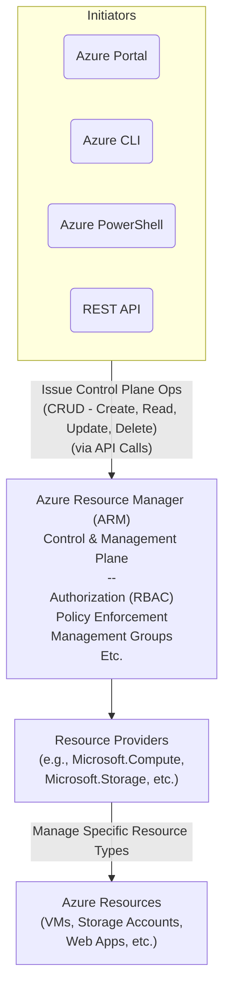

# ARM Templates and Azure Resource Manager

## Azure Resource Manager (ARM)

Azure Resource Manager (ARM) serves as the **control plane** and **management plane** for Azure. All management operations, specifically the **control plane operations** (Create, Read, Update, Delete), flow through ARM, regardless of how they are initiated (Portal, CLI, PowerShell, REST API).



*   Everything you do on Azure at the end of the day is an API call.
*   ARM is the central point that processes these calls for resource management.
*   It deals with crucial aspects like authorization (RBAC), policy, management groups, etc.
*   Resources are organized by **Resource Providers** (e.g., `Microsoft.Storage`, `Microsoft.Compute`). Each provider exposes the available operations.

## What is an ARM Template?

An ARM template is a **declarative** way to define the Azure resources you want to deploy.

*   It's typically written in JSON format (though other formats like Bicep now exist, ARM templates are the focus here).
*   You declare the *desired state* of your infrastructure in the template file.
*   Deploying an ARM template is a **control plane operation** that goes through Azure Resource Manager.

## Anatomy of an ARM Template (JSON Structure)

An ARM template is a JSON file with a standard structure.

```json
{
  "$schema": "https://schema.management.azure.com/schemas/2019-04-01/deploymentTemplate.json#",
  "contentVersion": "1.0.0.0",
  "parameters": {
    "storageAccountName": {
      "type": "string",
      "metadata": {
        "description": "The name of the Azure Storage Account. Must be globally unique."
      },
      "minLength": 3,
      "maxLength": 24,
      "defaultValue": "[concat('stor', uniqueString(resourceGroup().id))]" // Example dynamic default
    },
    "location": {
      "type": "string",
      "defaultValue": "[resourceGroup().location]",
      "metadata": {
        "description": "The location for the storage account. Defaults to the resource group location."
      }
    },
    "storageAccountSku": {
      "type": "string",
      "defaultValue": "Standard_LRS",
      "allowedValues": [
        "Standard_LRS",
        "Standard_GRS",
        "Standard_RAGRS",
        "Standard_ZRS",
        "Premium_LRS",
        "Premium_ZRS"
      ],
      "metadata": {
        "description": "The SKU for the storage account."
      }
    }
  },
  "variables": {
    // Variables section can be used for values derived from parameters
    // or for complex expressions used multiple times.
    // Keeping it simple here, but could define things like:
    // "diagnosticStorageAccountName": "[concat(parameters('storageAccountName'), 'diag')]"
  },
  "resources": [
    {
      "type": "Microsoft.Storage/storageAccounts", // Resource Provider + Type
      "apiVersion": "2021-06-01",                  // API version for this resource type
      "name": "[parameters('storageAccountName')]", // Resource name (using parameter expression)
      "location": "[parameters('location')]",      // Resource location (using parameter expression)
      "sku": {                                   // SKU configuration
        "name": "[parameters('storageAccountSku')]" // SKU name (using parameter expression)
      },
      "kind": "StorageV2",                        // Type of storage account (e.g., GeneralPurposeV2)
      "properties": {                             // Resource-specific configuration properties
        "accessTier": "Hot",
        "supportsHttpsTrafficOnly": true
      }
    }
  ],
  "outputs": {
    "storageAccountName": {
      "type": "string",
      "value": "[parameters('storageAccountName')]" // Output the name that was used
    },
    "storageAccountEndpoint": {
      "type": "object",
      "value": "[reference(resourceId('Microsoft.Storage/storageAccounts', parameters('storageAccountName'))).primaryEndpoints]" // Output primary endpoints
    }
  }
}
```

Key top-level properties include:

*   **`$schema`**: (Standard) Defines the template language version and properties available. Typically points to a standard schema URI.
*   **`contentVersion`**: (Optional but Recommended) A string value you define to version your template itself. Useful for tracking changes to the template file over time.
*   **`parameters`**: (Optional) Allows you to specify values that can be input when the template is deployed. This is crucial for making templates reusable across different environments (e.g., resource names, locations, SKUs). You can define parameter types, default values, allowed values, etc.
*   **`variables`**: (Optional) Allows you to define values that are constructed or retrieved *within* the template itself and can be used multiple times throughout the template. Useful for avoiding hardcoding and simplifying complex expressions (e.g., constructing resource names based on parameters).
*   **`resources`**: (Required) This is the core section. It is an **array** where you define the specific Azure resources you want to create or configure. Each object in the array represents a single resource and includes properties like:
    *   `type`: The Resource Provider and resource type (e.g., `Microsoft.Storage/storageAccounts`).
    *   `apiVersion`: The API version for that specific resource type.
    *   `name`: The name of the resource.
    *   `location`: The Azure region where the resource will be deployed.
    *   `properties`: Resource-specific settings and configuration.
*   **`outputs`**: (Optional) Allows you to define values that are returned after the template deployment completes (e.g., the connection string of a deployed storage account, the public IP address of a VM). While possible, the primary goal of a template is often just resource creation.

### Expressions (`[]`)

Within an ARM template, anything enclosed in square brackets `[]` is an **expression**. Expressions allow you to dynamically retrieve values, reference parameters or variables, call template functions (like `resourceGroup().location`), and perform operations. This is how you make the template dynamic and reusable. Examples include:

*   `[parameters('resourceName')]`: Accessing the value of a parameter named 'resourceName'.
*   `[variables('storageAccountLocation')]`: Accessing the value of a variable named 'storageAccountLocation'.
*   `[resourceGroup().location]`: Getting the location of the Resource Group the template is being deployed to.

## Deploying an ARM Template

ARM templates can be deployed using:

*   Azure CLI (`az deployment group create`)
*   Azure PowerShell (`New-AzResourceGroupDeployment`)
*   Azure Portal
*   REST API
*   Azure DevOps / GitHub Actions (using deployment tasks/actions)

Deployments can be scoped to a **Resource Group** (most common and best practice) or a **Subscription**.

When deploying, you provide the template file and can supply parameter values (either inline in the command or, more commonly and as best practice, via a separate `parameters.json` file).

Behind the scenes, ARM parses the template and `parameters.json` file, resolves all expressions, and translates the desired state into a sequence of REST API calls to create or update the resources in the specified scope.

## Advantages of Using ARM Templates

Using ARM templates offers significant benefits, aligning with the principles of Infrastructure as Code (IaC):

1.  **Declarative:** Defines *what* you want, not the step-by-step process *how* to get there. This makes them repeatable.
2.  **Repeatable across Environments:** The same template can be used to deploy identical infrastructure consistently across different environments (e.g., dev, test, production Resource Groups, or subscriptions) by using parameters.
3.  **Version Control:** As they are code files (JSON), templates can be stored in version control systems (like Git) to track changes, collaborate, and revert if needed.
4.  **Infrastructure as Code (IaC):** Represents your cloud infrastructure as code, enabling automation, consistency, and traceability.

Mastering ARM templates (or a modern abstraction like Bicep) is essential for developers managing Azure infrastructure as code.