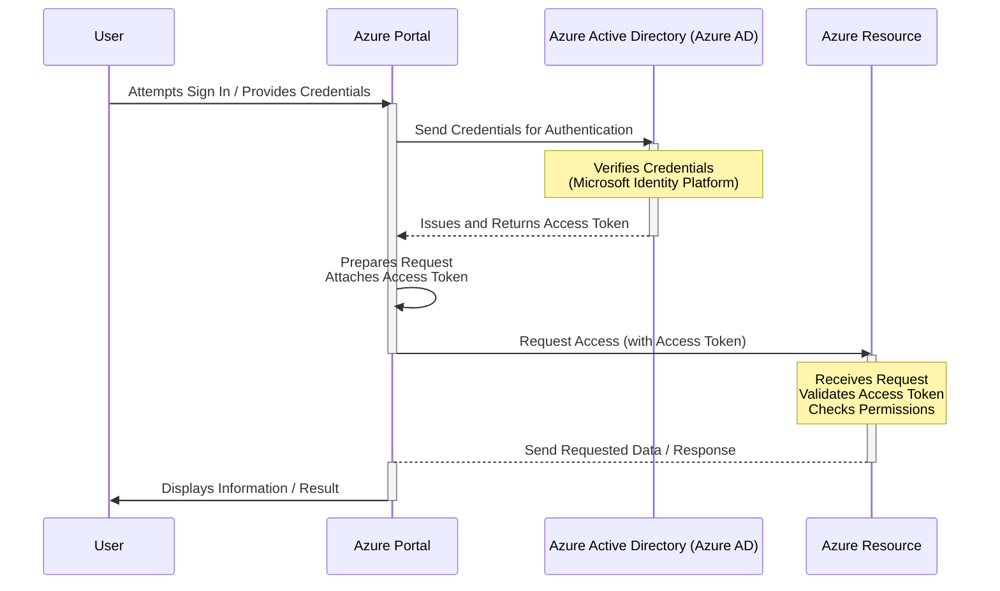

# Microsoft Identity Platform

The **Microsoft Identity Platform** is Microsoft's **Identity as a Service (IDaaS)** offering. Its primary responsibility is **issuing tokens** to users and applications, enabling secure access to resources.

## What is Identity as a Service (IDaaS)?

Just like Platform as a Service (PaaS) or Infrastructure as a Service (IaaS), Identity as a Service is a cloud-based service that provides identity and access management capabilities. The Microsoft Identity Platform provides the services needed for authentication (verifying identity) and authorization (determining access rights).

## What are Tokens?

Tokens, in this context, are typically secure strings (like **Base64 URL-encoded strings**) that serve as proof of identity and authorization. They contain information about the user or application that has been authenticated.

*   **Content:** Tokens embed **access level information** (also known as *scopes* or *permissions*). Examples include permissions like `files.read`, `files.write`, etc.
*   **Purpose:** When an application or user wants to access a secured resource, they present a token with their request. The resource provider (the backend service hosting the resource) reads the token to **confirm that the caller has the necessary permissions** to perform the requested action.

## Example: Azure Portal Access

A common example demonstrating the use of tokens is accessing Azure resources via the Azure portal:

1.  A **User** attempts to sign in to the Azure portal and provides **Credentials**.
2.  The Azure portal sends these credentials to **Azure Active Directory (Azure AD)**, which is part of the Microsoft Identity Platform.
3.  Azure AD verifies the credentials. If they are correct, Azure AD issues an **Access Token** back to the Azure portal.
4.  The Azure portal then uses this **Access Token** when making requests to access other Azure resources (like reading storage account data or fetching alert information).
5.  The backend service hosting the Azure resource (e.g., Azure Storage service, Azure Alerts service) receives the request with the attached Access Token. It validates the token and checks the embedded access level information to determine if the portal (acting on behalf of the user) has permission to access the requested resource.

This flow ensures that only authenticated and authorized parties can interact with sensitive Azure resources. You can often observe these tokens (often in the `Authorization: Bearer <token>` header) in your browser's developer tools when interacting with the Azure portal.

## Authorization Flows

The process of getting tokens involves different **authorization flows**. The specific flow used depends on the type of client application making the request:

*   **Single Page Applications (SPAs):** Use flows optimized for client-side web applications running in a browser.
*   **Native Applications:** Desktop or mobile applications use flows designed for applications installed on a device.
*   **Backend Applications (Web Apps, APIs):** Server-side applications and APIs use flows suitable for confidential clients.

Each flow is designed to securely issue tokens based on the client's architecture and abilities.

Understanding the role of the Microsoft Identity Platform as an Identity as a Service and the concept of tokens and authorization flows is crucial for building secure applications that interact with Azure resources.