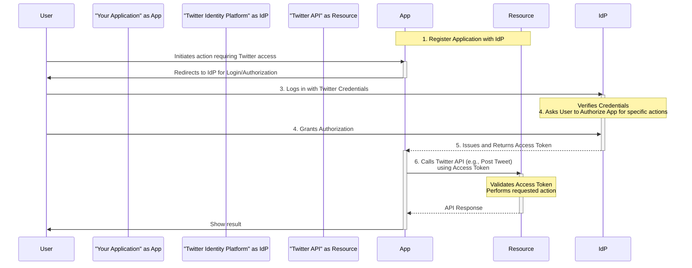

# OAuth 2.0

**OAuth 2.0** (often simply called OAuth) is an industry-standard protocol designed to allow an application to get **limited access** to a user's data or functionality on a service without the user having to share their credentials directly with that application.

## The Problem OAuth Solves (The "Old Way")

Before protocols like OAuth, if you built an application and wanted it to perform actions on a third-party service on a user's behalf, the common (but insecure) practice was for the user to provide their username and password for that service directly to your application.

*   Your application would store or use these credentials to log in to the third-party service's API and perform actions.
*   **Problem:** Users had to trust your application completely with their highly sensitive credentials, which granted your application full control over their account and posed significant security risks.

## The OAuth 2.0 Approach

OAuth 2.0 introduces a delegated authorization model. Using the Twitter example:

1.  **Register Application:** You first register your application with the Twitter Identity Platform (their authorization server).
2.  **User Interaction:** When a user wants your application to tweet on their behalf, your application redirects the user to the **Twitter Identity Platform** for login and authorization.
3.  **User Authenticates:** The user logs in directly with their Twitter credentials on the **Twitter Identity Platform's** secure page. The user's credentials are **only shared with the Twitter Identity Platform**, *not* your application.
4.  **User Authorizes:** The Twitter Identity Platform asks the user if they authorize *your specific application* to perform *specific actions* (e.g., "Post Tweets").
5.  **Identity Platform Issues Token:** If the user grants authorization, the Twitter Identity Platform issues an **Access Token** to your application. This token represents the user's permission for your app to perform the authorized actions.
6.  **Application Uses Token:** Your application then uses this **Access Token** when calling the Twitter API to post tweets on behalf of the user. The token proves that the user has authorized this specific action by this specific application.

## Key Benefit

The core benefit of OAuth 2.0 is that the user's sensitive **credentials are never shared with or stored by the third-party application**. The application receives a limited-use token instead, which can also be revoked by the user at any time.

OAuth was developed precisely to enable this secure delegation of authority, allowing applications to access APIs and resources on behalf of users without compromising user security by requiring them to share their passwords.