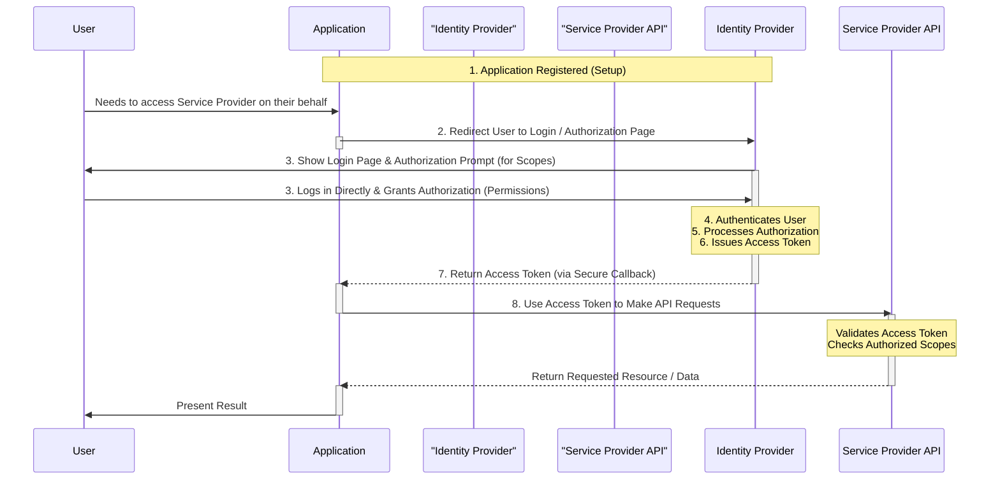

# OAuth 2.0

**OAuth 2.0** is an industry-standard protocol for **authorization**. It allows a user to grant a third-party application access to their information or resources hosted by another service provider (like Twitter, Facebook, Google) **without sharing their username and password** with the third-party application.

### The Problem Without OAuth 2.0

In older models, if you wanted an application (e.g., an "Automatic Twitter Tweeter") to perform actions on your behalf (like posting tweets), you would have to provide your username and password directly to that application. This is a major security risk, as the application could potentially store your credentials or access more than you intended.

### The OAuth 2.0 Solution

OAuth 2.0 solves this by introducing an authorization layer, often mediated by an **Identity Provider** (like Twitter's identity platform). The simplified flow is:

1.  You register your application with the service provider's (e.g., Twitter's) Identity Platform.
2.  When your application needs to act on behalf of a user, it redirects the user to the Identity Platform's login page.
3.  The **User logs in directly to the Identity Platform** using their credentials.
4.  The Identity Platform authenticates the user and, if successful, prompts the user to authorize your application to access specific resources or perform specific actions (known as **scopes** or **permissions**).
5.  If the user grants permission, the Identity Platform issues an **Access Token** and returns it to your application (via a secure callback mechanism).
6.  Your application then uses this **Access Token** when making requests to the service provider's APIs (e.g., the Twitter API) on behalf of the user.

**Key Point:** The user's credentials are **only shared with the trusted Identity Platform**, never directly with the third-party application. The application receives a token that represents the *permission* granted by the user, not the user's identity itself (that's where OpenID Connect comes in). The output of an OAuth 2.0 flow is an **Access Token**.

## Authentication vs. Authorization

It's crucial to understand the distinction:

*   **Authentication:** The process of verifying *who* a user or application is (proving identity).
*   **Authorization:** The process of determining *what* an authenticated user or application is allowed to do (checking permissions/access rights).

OAuth 2.0 is primarily an **authorization** framework, providing tokens used to prove permission to access resources.

## OpenID Connect (OIDC)

**OpenID Connect (OIDC)** is an identity layer built **on top of OAuth 2.0**. While OAuth 2.0 is for authorization, OIDC is for **authentication**.

*   When you use a login flow that supports OIDC (like "Sign in with Facebook"), you typically receive **two** tokens:
    *   An **ID Token:** A security token (usually a JSON Web Token—JWT) that contains claims about the authenticated user's identity (e.g., name, email, etc.). It's used by the application to know *who the user is*. This is for **authentication**.
    *   An **Access Token:** The OAuth 2.0 token used to authorize access to specific resources or APIs on behalf of the user (e.g., accessing their friends' list on Facebook). This is for **authorization**.

The output of an OpenID Connect flow is typically an **ID Token** (in addition to the Access Token provided by the underlying OAuth 2.0 flow).

## Why is this Important for Your Own Applications?

Leveraging Identity Providers like Microsoft Entra ID (formerly Azure AD), Google, Facebook, etc., in your own applications using these standards is highly beneficial for several reasons:

*   **Improved User Experience:** Users can sign in using existing identities, avoiding the need to create and remember new usernames and passwords (Single Sign-On).
*   **Outsource Complexity:** You outsource the complex and security-sensitive tasks of user authentication, password management, and potentially basic authorization to a specialized, trusted provider. This significantly reduces your development and maintenance burden.
*   **Enhanced Security:** You leverage the robust security infrastructure and expertise of major identity providers, which are dedicated to protecting user credentials and managing identity threats.

By integrating your applications with an Identity Provider using standards like OAuth 2.0 and OpenID Connect, you enhance security, improve the user experience, and simplify your development efforts by outsourcing identity management.